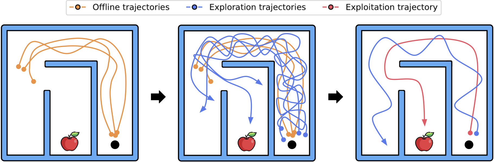

# Offline RL for Online RL: Decoupled Policy Learning for Mitigating Exploration Bias
<p align="center">

</p>

This repository contains the official implementation of [Offline RL for Online RL: Decoupled Policy Learning for Mitigating Exploration Bias](https://google.com) by Max Sobol Mark*, Archit Sharma*, Fahim Tajwar, Rafael Rafailov, Sergey Levine, and Chelsea Finn.

We build on top of the original implementations for each algorithm, and since each of them uses different package versions, a separate Python environment is needed for each algorithm.

[**Setting-up environments**](#setting-up-environments)
| [**OOO for IQL**](#ooo-for-iql)
| [**OOO for Cal-QL**](#ooo-for-cal-ql)
| [**OOO for RLPD**](#ooo-for-rlpd)


## Setting up environments

### Harder exploration tasks from paper
The paper introduces `antmaze-goal-missing-large-v2` and `maze2d-missing-data-large-v1`, environments in which no goal-reaching data is provided, as well as `point-mass-wall`, a didactic example environment. To run these environments, please download and unzip [these files](https://drive.google.com/file/d/1ADrjE5ZC9r0UzS-vLakq1Xtz9XEWRBPn/view?usp=sharing) into the `datasets` subfolder.

### Adroit Manipulation Suite Setup

1. Download and unzip the `.npy` files into `~/.datasets/awac-data/` from [here](https://drive.google.com/file/d/1SsVaQKZnY5UkuR78WrInp9XxTdKHbF0x/view).
2. Install `mjrl` on the conda environment of either [IQL](#prepare-environment-for-iql) or [Cal-QL](#prepare-environment-for-cal-ql):
```bash
$ git clone --recursive https://github.com/nakamotoo/mj_envs.git
$ cd mjrl
$ git submodule update --remote
$ pip install -e .
```


## OOO for IQL

We build on top of the [original IQL implementation](https://github.com/ikostrikov/implicit_q_learning). 

### Prepare environment for IQL

```bash
$ conda create -n ooo_iql python=3.9
$ conda activate ooo_iql

$ pip install -r OOO_for_iql/requirements.txt

$ conda install -c conda-forge patchelf
```

### Run offline pre-training and online fine-tuning for exploratory data collection

```bash
XLA_PYTHON_CLIENT_PREALLOCATE=false python OOO_for_iql/train_finetune_decoupled.py --env_name=kitchen-{dataset:partial,complete,mixed}-v0 \
                --config=OOO_for_iql/configs/kitchen_decoupled_finetune_config.py \
                --exp_name=iql_rnd10_kitchen_{dataset} \
                --replay_buffer_size=4500000 --max_steps=4000000 \
                --num_pretraining_steps=1000000 \
                --seed=0 \
                --rewards_bias=-4 \
                --use_rnd=True \
                --intrinsic_reward_scale=10
```
See scripts for every environment [here](ooo_for_iql_scripts.md)

### Run Offline RL for Exploitation phase

```bash
XLA_PYTHON_CLIENT_PREALLOCATE=false python OOO_for_iql/train_only_exploitation.py --exp_name=iql_rnd10_exploitation_kitchen_{dataset:partial,complete,mixed} \
                --env_name=kitchen-{dataset}-v0 \
                --seed=0 \
                --config=OOO_for_iql/configs/kitchen_exploitation_only_upsampling_config.py \
                --max_steps=2000000 \
                --replay_buffer_path=./results/iql_rnd10_kitchen_{dataset}/0/replay_buffer.npz \
                --offline_dataset_size={dataset:136950,3680,136950} \
                --online_eval_timesteps=1000000,2000000,3000000,4000000 \
                --rewards_bias=-4
```
See scripts for every environment [here](ooo_for_iql_scripts.md)

## OOO for Cal-QL

We build on top of the [original Cal-QL implementation](https://github.com/nakamotoo/Cal-QL). 

### Prepare environment for Cal-QL

```bash
$ conda create -n ooo_calql python=3.9
$ conda activate ooo_calql

$ pip install -r OOO_for_calql/requirements.txt

$ conda install -c conda-forge patchelf
```

### Run offline pre-training and online fine-tuning for exploratory data collection

```bash
XLA_PYTHON_CLIENT_PREALLOCATE=false python OOO_for_calql/conservative_sac_main.py --exp_name=calql_rnd10_kitchen_{dataset} \
                --env=kitchen-{dataset:partial,complete,mixed}-v0 \
                --seed=0 \
                --cql_min_q_weight=5.0 \
                --cql.cql_importance_sample=False \
                --policy_arch=512-512-512 \
                --qf_arch=512-512-512 \
                --n_pretrain_epochs=500 \
                --max_online_env_steps={dataset:1e6,4e6,1e6} \
                --mixing_ratio=0.25 \
                --reward_bias=-5 \
                --logging.output_dir=./results/calql_rnd10_kitchen_{dataset}/seed_0/ \
                --cql.use_rnd=True \
                --cql.rnd_reward_scale=10 \
                --cql.bound_q_functions=True \
                --cql.max_reward=0.5
```
See scripts for every environment [here](ooo_for_calql_scripts.md)

### Run Offline RL for Exploitation phase

```bash
XLA_PYTHON_CLIENT_PREALLOCATE=false python OOO_for_calql/conservative_sac_exploitation.py --exp_name=cql_exploitation_kitchen_{dataset:partial,complete,mixed}_timestep_{timestep:100000,250000,500000,1000000,2000000,3000000,4000000} \
                --env=kitchen-{dataset}-v0 \
                --seed=0 \
                --cql_min_q_weight=5.0 \
                --cql.cql_importance_sample=False \
                --policy_arch=512-512-512 \
                --qf_arch=512-512-512 \
                --mixing_ratio=0.25 \
                --reward_bias=-4.0 \
                --replay_buffer_original_bias=-5 \
                --cql.use_rnd=False \
                --logging.output_dir=./results/cql_exploitation_***env***/timestep_{timestep}/seed_0 \
                --exploitation_timestep={timestep} \
                --replay_buffer_path=./results/calql_rnd10_kitchen_{dataset}/seed_0/replay_buffer.npz \
                --replay_buffer_size=4000000 \
                --bound_q_functions_according_to_data=True \
                --cql.feature_normalization=True
```
See scripts for every environment [here](ooo_for_calql_scripts.md)


## OOO for RLPD

We build on top of the [original RLPD implementation](https://github.com/ikostrikov/rlpd). 

### Prepare environment for RLPD

```bash
$ conda create -n ooo_rlpd python=3.9
$ conda activate ooo_rlpd

$ pip install -r OOO_for_rlpd/requirements.txt

$ conda install -c conda-forge patchelf
```

### Run the Online phase for halfcheetah and ant sparse

Ant sparse:

```bash
XLA_PYTHON_CLIENT_PREALLOCATE=false python OOO_for_rlpd/train_finetuning_decoupled.py --exp_name=rlpd_rnd10_ant_sparse \
                --env_name=ant-sparse-v2 \
                --utd_ratio=20 \
                --start_training 5000 \
                --max_steps 1000000 \
                --config=OOO_for_rlpd/configs/rlpd_rnd_10.py \
                --seed=0 \
                --offline_ratio=0
```

Halfcheetah sparse:

```bash
XLA_PYTHON_CLIENT_PREALLOCATE=false python OOO_for_rlpd/train_finetuning_decoupled.py --exp_name=rlpd_rnd10_halfcheetah_sparse \
                --env_name=halfcheetah-sparse-v2 \
                --utd_ratio=20 \
                --start_training=5000 \
                --max_steps=1000000 \
                --config=OOO_for_rlpd/configs/rlpd_rnd_10.py \
                --seed=0 \
                --offline_ratio=0
```


### Run Offline RL for Exploitation phase

Ant sparse:

```bash
XLA_PYTHON_CLIENT_PREALLOCATE=false python OOO_for_rlpd/train_only_exploitation.py --exp_name=rlpd_exploitation_ant_sparse_from_rnd10_timestep_{timestep:250000,500000,750000,1000000} \
                --env_name=ant-sparse-v2 \
                --seed=0 \
                --buffer_end_index={timestep} \
                --dataset_path=./results/rlpd_rnd10_ant_sparse/0/buffers/buffer \
                --upsample_batch_size=32
```

Halfcheetah sparse:

```bash
XLA_PYTHON_CLIENT_PREALLOCATE=false python train_offline.py --exp_name=rlpd_exploitation_halfcheetah_sparse_from_rnd10_timestep_{timestep:250000,500000,750000,1000000} \
                --env_name=halfcheetah-sparse-v2 \
                --seed=0 \
                --buffer_end_index={timestep} \
                --dataset_path=./results/rlpd_rnd10_halfcheetah_sparse/0/buffers/buffer \
                --upsample_batch_size=32
```


